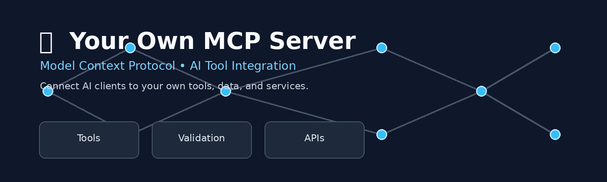

# 🔌 Your Own MCP Server

<div align="center">



### A Custom Model Context Protocol Server for AI Tool Integration

<p>


</p>

</div>

---

## 📌 Overview

**Your Own MCP Server** is a custom implementation of the **Model Context Protocol (MCP)** that exposes application capabilities and data as structured tools that AI clients can discover and call.

The project demonstrates how an AI application can interact with external functionality through well-defined MCP tools instead of directly accessing application internals.

The server is designed with:

- Structured tool definitions
- Input validation
- Error handling
- Modular architecture
- AI client interoperability
- Extensible tool support

---

# 🎯 Project Objective

The main objective of this project is to demonstrate how developers can build and expose their own application functionality through MCP.

```text
AI Client
    │
    ▼
MCP Protocol
    │
    ▼
Custom MCP Server
    │
    ├── Tool 1
    ├── Tool 2
    ├── Tool 3
    └── Tool 4
    │
    ▼
Application / Data
🧠 What is MCP?

Model Context Protocol (MCP) is a protocol that allows AI applications to interact with external tools, resources, and data through a standardized interface.

Instead of building a separate integration for every AI client, an MCP server can expose capabilities through structured tools.

Example
User
  │
  ▼
AI Assistant
  │
  ▼
MCP Client
  │
  ▼
MCP Server
  │
  ├── Search Data
  ├── Read File
  ├── Query Database
  ├── Process Information
  └── Execute Application Function
  │
  ▼
Result
  │
  ▼
AI Assistant
✨ Key Features
Feature	Description
🔧 Custom Tools	Expose application functions as MCP tools
📋 Tool Schemas	Clearly defined input and output structures
✅ Validation	Validate tool arguments before execution
⚠️ Error Handling	Handle invalid requests and execution failures
🔄 Extensible	Easily add new MCP tools
🤖 AI Compatible	Designed for MCP-enabled AI clients
🧩 Modular	Separate tools and application logic
📝 Documentation	Includes examples for using the server
🏗️ System Architecture
                 ┌──────────────────────┐
                 │      AI Client       │
                 │                      │
                 │  Claude / MCP Host   │
                 └──────────┬───────────┘
                            │
                            │ MCP
                            ▼
                 ┌──────────────────────┐
                 │    MCP Server        │
                 │                      │
                 │  Tool Discovery      │
                 │  Tool Validation     │
                 │  Request Handling    │
                 └──────────┬───────────┘
                            │
             ┌──────────────┼──────────────┐
             ▼              ▼              ▼
       ┌───────────┐  ┌───────────┐  ┌───────────┐
       │ Tool 1    │  │ Tool 2    │  │ Tool 3    │
       │ Search    │  │ Database  │  │ Files     │
       └─────┬─────┘  └─────┬─────┘  └─────┬─────┘
             │              │              │
             └──────────────┼──────────────┘
                            ▼
                 ┌──────────────────────┐
                 │ Application / Data   │
                 └──────────────────────┘
🔧 MCP Tools

The server can expose custom tools based on the application's requirements.

Example Tool Structure
Tool
├── Name
├── Description
├── Input Schema
├── Validation
├── Execution
└── Response
Example
{
  "name": "search_data",
  "description": "Search application data using a query",
  "inputSchema": {
    "type": "object",
    "properties": {
      "query": {
        "type": "string"
      }
    },
    "required": ["query"]
  }
}
🔄 Request Flow
1. AI Client discovers MCP Server
             ↓
2. Server exposes available tools
             ↓
3. AI selects an appropriate tool
             ↓
4. Tool arguments are received
             ↓
5. Input is validated
             ↓
6. Application logic is executed
             ↓
7. Result is returned to AI Client
🛡️ Validation & Error Handling

The server is designed to validate incoming tool requests before execution.

Example:

Valid Request
     │
     ▼
Input Validation
     │
     ├── Valid ───────► Execute Tool
     │
     └── Invalid ─────► Return Error

The implementation should avoid exposing sensitive internal information through error messages.

🖥️ Example Use Cases

This MCP architecture can be adapted for:

📁 File management
🗄️ Database access
📊 Data analytics
🔎 Search systems
💼 Job data
🌐 Internal APIs
📈 Business intelligence
🧠 Knowledge systems
⚙️ Developer tools
📸 Project Screenshots
MCP Server
<div align="center">  </div>
Available Tools
<div align="center">  </div>
AI Client Interaction
<div align="center">  </div>
🛠️ Technology Stack

Use only the technologies actually implemented in your project.

MCP
Python / TypeScript
JSON
Git
GitHub
MCP SDK
📂 Project Structure
your-mcp-server/
│
├── assets/
│   ├── mcp-banner.png
│   └── screenshots/
│       ├── server.png
│       ├── tools.png
│       └── client.png
│
├── src/
│   ├── server
│   ├── tools
│   └── ...
│
├── tests/
│
├── README.md
├── package.json
├── .gitignore
└── ...
🚀 Getting Started
1. Clone the Repository
git clone https://github.com/Naveenkumar210225/YOUR-REPOSITORY.git
2. Navigate to the Project
cd YOUR-REPOSITORY
3. Install Dependencies

For a Node.js project:

npm install

For a Python project:

pip install -r requirements.txt

Use the command matching your actual implementation.

▶️ Running the Server

Start the MCP server using the project's configured entry point.

Example:

npm start

or:

python server.py
🧪 Testing

The project can be tested by verifying:

MCP server startup
Tool discovery
Input validation
Tool execution
Error handling
AI client communication
Response formatting
🔮 Future Enhancements
🔐 Authentication and authorization
🗄️ Database integrations
📊 Analytics tools
🌐 External API integrations
🔎 Advanced search
🧠 Knowledge-base integration
📝 Request logging
📈 Monitoring dashboard
🐳 Docker deployment
☁️ Cloud deployment
🧪 Automated integration tests
💼 Portfolio Value

This project demonstrates practical experience with:

Model Context Protocol
AI tool integration
API and application integration
Tool schema design
Input validation
Error handling
Modular software architecture
AI agent interoperability
👨‍💻 Author
<div align="center">
Naveen Kumar V

BE Computer Science and Engineering

<a href="https://github.com/Naveenkumar210225">  </a> </div>
📄 License

This project is available for educational and portfolio purposes.
